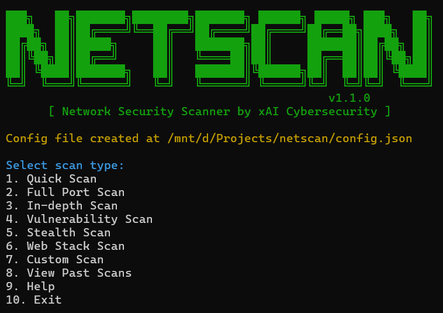

# NetScan v1.1.0

A Python-based network scanning tool by xAI Cybersecurity for network administrators and security professionals.



## Overview

NetScan is a comprehensive network scanning tool built on top of Nmap to provide efficient network discovery, port scanning, service enumeration, and vulnerability detection. Designed for security professionals and network administrators, NetScan offers an intuitive interface with multiple scan types and detailed reporting capabilities.

## Features

- **Multiple Scan Types**: From quick scans to in-depth vulnerability assessments
- **Service Detection**: Identifies running services and their versions
- **OS Detection**: Determines the operating system of target hosts
- **Vulnerability Detection**: Checks for known vulnerabilities based on service versions
- **Detailed Reporting**: Generates comprehensive reports for each scan
- **Scan History**: Maintains a database of past scans for easy reference
- **Command-line and Interactive Modes**: Use in scripts or as an interactive tool

## Requirements

- Python 3.6+
- Nmap 7.0+
- Root/Administrator privileges (for certain scan types)

## Dependencies

- python-nmap
- colorama
- prompt_toolkit
- tqdm

## Installation

1. Clone the repository:
   ```
   git clone https://github.com/xai-cybersecurity/netscan.git
   cd netscan
   ```

2. Install dependencies:
   ```
   pip install -r requirements.txt
   ```

3. Ensure Nmap is installed:
   - Linux: `sudo apt install nmap` (Debian/Ubuntu) or `sudo yum install nmap` (CentOS/RHEL)
   - macOS: `brew install nmap`
   - Windows: Download and install from [nmap.org](https://nmap.org/download.html)

## Usage

### Interactive Mode

Run NetScan without arguments to use the interactive mode:

```
python netscan.py
```

You'll be presented with a menu of available scan types:

1. Quick Scan - Fast scan of common ports
2. Full Port Scan - Comprehensive scan of all 65535 ports
3. In-depth Scan - Detailed scan with OS detection and service fingerprinting
4. Vulnerability Scan - Scan for known vulnerabilities
5. Stealth Scan - Low-profile scan to avoid detection
6. Web Stack Scan - Focused scan for web servers and applications
7. Custom Scan - Scan with custom Nmap arguments
8. View Past Scans - Review previously run scans
9. Help - Display help information
10. Exit - Exit NetScan

### Command-line Mode

NetScan can also be used directly from the command line:

```
python netscan.py -t <target> -s <scan_type> [-a <custom_args>]
```

Options:
- `-t, --target`: Target IP, hostname, or range (e.g., 192.168.1.1, example.com, 192.168.1.1-10)
- `-s, --scan`: Scan type (1-7)
- `-a, --args`: Custom scan arguments (for scan type 7)

Examples:
```
# Quick scan of a single host
python3 ./netscan_tool.py -t 192.168.1.1 -s 1

# Vulnerability scan of a network range
python3 netscan_tool.py -t 192.168.1.1-254 -s 4

# Custom scan with specific arguments
python netscan_tool.py -t example.com -s 7 -a "-p 80,443,8080 -sV --script=vuln"
```

## Configuration

NetScan uses a `config.json` file to store settings and vulnerability information. This file is created automatically on first run with default values.

You can customize:
- Known vulnerable software versions
- CVE identifiers
- Severity ratings
- Remediation actions
- Scan timeouts and other settings

## Output

Scan reports are saved to the `scans/` directory with filenames in the format:
```
<scan_type>_<target>_<timestamp>.txt
```

Each report includes:
- Scan details (target, type, date, duration)
- Host information
- Open ports and services
- OS detection results
- Script output (if applicable)
- Vulnerability assessment (for vulnerability scans)
- Summary statistics

## Scan History

All scan results are stored in an SQLite database (`scan_history.db`), allowing you to review past scans from the interactive menu.

## Customizing the Vulnerability Database

Edit the `config.json` file to add or update vulnerable software entries:

```json
{
  "vulnerable_software": {
    "Apache 2.4.29": {
      "cve": "CVE-2021-44790",
      "severity": "HIGH",
      "action": "Upgrade to Apache 2.4.52 or later"
    },
    ...
  }
}
```

## Security and Legal Notice

NetScan is intended for legitimate security testing of systems you own or have permission to scan. Unauthorized scanning of networks may violate laws and regulations.

Always:
- Obtain proper authorization before scanning any network
- Use the tool responsibly and ethically
- Consider using the Stealth Scan option for sensitive environments

## License

MIT License

## Contributing

Contributions are welcome! Please feel free to submit a Pull Request.

## Credits

Developed by xAI Cybersecurity
Built with [python-nmap](https://pypi.org/project/python-nmap/) and [Nmap](https://nmap.org/)
